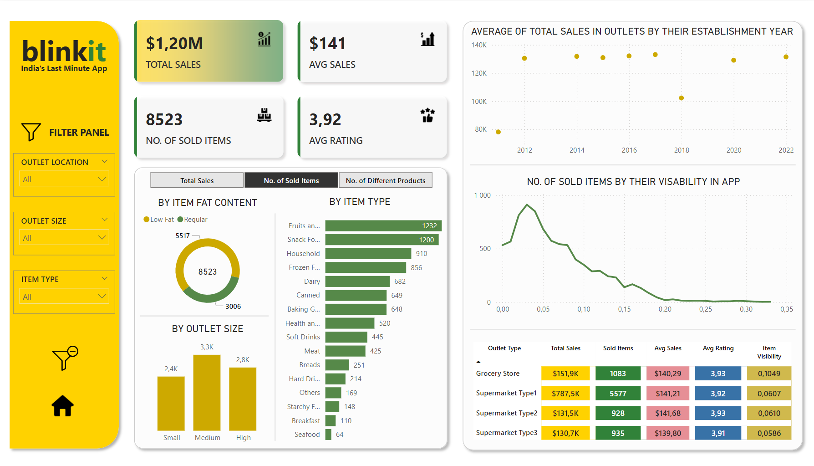

# Blinkit Sales Analysis (Power BI & Power Query)

## Project Overview

**Level**: Intermediate  

This project demonstrates data analysis of blinkit, an Indian last-minute grocery delivery app. The goal was to analyze sales with operational data to uncover insights for business improvement but also to present data to the client in the most accessible way possible. The analysis involved data preparation, transformation, calculation and visualization using **Power BI** and **Power Query**.


*Figure 1: First page of the BlinkIT Report after data fixes.*

## Objectives

1. **Perform data cleaning and transformation**: Ensure the dataset is accurate and ready for analysis by resolving data inconsistencies and adjusting the form of data, creating additional columns if needed.
2. **Data calculations**: Create DAX measures in Power BI to calculate and display various Key Performance Indicators (KPIs).
3. **Visualize data**: Build interactive Power BI dashboards to uncover key correlations and enable stakeholders to explore the data dynamically.
4. **Analyze results**: Carefully analyze all charts and other visualizations to draw conclusions and detect any previously unnoticed data inconsistencies.
5. **Generate Business Insights**: Provide actionable insights to aid decision-making, including outlet performance, sales trends, and product visibility.

## Project Structure

### 1. Performing data cleaning and transformation
- **Initial data exploration**

  The dataset consisted of grocery sales data extracted from Excel. Data walkthrough revealed the following fields:
  - Item Details: `Item Fat Content`, `Item Identifier`, `Item Type`, `Item Visibility`, etc.
  - Outlet Details: `Outlet Identifier`, `Outlet Size`, `Outlet Type`, `Establishment Year`, etc.

- **Data preparation in Power Query**

  The data exhibited a reasonable level of quality so data preparation involved merely two actions taken in several Power Query steps before creating visualizations in Power BI:
  - Cleaning 'Item Fat Content' Values: Standardized the values in the 'Item Fat Content' column by replacing inconsistent entries.
  - Rounding 'Item Visibility' Values: Duplicated the 'Item Visibility' column and rounded off the values to two decimal places in the new column.

  Query code (M language):
  ```M
  let
    Źródło = Excel.Workbook(File.Contents("C:\Users\julit\Pulpit\Analiza_danych_nauka\portfolio\Projekty\BlinkIT Grocery Data.xlsx"), null, true),
    #"BlinkIT Grocery Data_Sheet" = Źródło{[Item="BlinkIT Grocery Data",Kind="Sheet"]}[Data],
    #"Promoted Headers" = Table.PromoteHeaders(#"BlinkIT Grocery Data_Sheet", [PromoteAllScalars=true]),
    #"Changed Type" = Table.TransformColumnTypes(#"Promoted Headers",{{"Item Fat Content", type text}, {"Item Identifier", type text}, {"Item Type", type text}, {"Outlet Establishment Year", Int64.Type}, {"Outlet Identifier", type text}, {"Outlet Location Type", type text}, {"Outlet Size", type text}, {"Outlet Type", type text}, {"Item Visibility", type number}, {"Item Weight", type number}, {"Sales", type number}, {"Rating", Int64.Type}}),
    #"Replaced Value (LF -> Low Fat)" = Table.ReplaceValue(#"Changed Type","LF","Low Fat",Replacer.ReplaceText,{"Item Fat Content"}),
    #"Replaved Value (reg -> Regular)" = Table.ReplaceValue(#"Replaced Value (LF -> Low Fat)","reg","Regular",Replacer.ReplaceText,{"Item Fat Content"}),
    #"Capitalized Each Word in 'Item Fat Content'" = Table.TransformColumns(#"Replaved Value (reg -> Regular)",{{"Item Fat Content", Text.Proper, type text}}),
    #"Duplicated Column 'Item Visibility'" = Table.DuplicateColumn(#"Capitalized Each Word in 'Item Fat Content'", "Item Visibility", "Item Visibility (rounded)"),
    #"Rounded Off the Values in New Column" = Table.TransformColumns(#"Duplicated Column 'Item Visibility'",{{"Item Visibility (rounded)", each Number.Round(_, 2), type number}}),
    #"Reordered Column 'Item Visibility (rounded)'" = Table.ReorderColumns(#"Rounded Off the Values in New Column",{"Item Fat Content", "Item Identifier", "Item Type", "Outlet Establishment Year", "Outlet Identifier", "Outlet Location Type", "Outlet Size", "Outlet Type", "Item Visibility", "Item Visibility (rounded)", "Item Weight", "Sales", "Rating"})
  in
    #"Reordered Column 'Item Visibility (rounded)'"

- **Creating additional query**

  Created a new query by referencing the main query to analyze total sales by outlet and showing their establishment year.

  Query code (M language):
  ```M
  let
    Source = #"BlinkIT Grocery Data",
    #"Grouped Rows (Total Sales by Outlet Identifier)" = Table.Group(Source, {"Outlet Identifier"}, {{"Total Sales in Particular Outlet", each List.Sum([Sales]), type nullable number}}),
    #"Merged Queries" = Table.NestedJoin(#"Grouped Rows (Total Sales by Outlet Identifier)", {"Outlet Identifier"}, #"BlinkIT Grocery Data", {"Outlet Identifier"}, "BlinkIT Grocery Data", JoinKind.LeftOuter),
    #"Expanded BlinkIT Grocery Data With Column 'Outlet Establishment Year'" = Table.ExpandTableColumn(#"Merged Queries", "BlinkIT Grocery Data", {"Outlet Establishment Year"}, {"Outlet Establishment Year"}),
    #"Removed Duplicates From 'Outlet Identifier' Column" = Table.Distinct(#"Expanded BlinkIT Grocery Data With Column 'Outlet Establishment Year'", {"Outlet Identifier"})
  in
    #"Removed Duplicates From 'Outlet Identifier' Column"

### 2. Data calculations

```DAX
Avg Rating = AVERAGE('BlinkIT Grocery Data'[Rating])
Avg Sales = AVERAGE('BlinkIT Grocery Data'[Sales])
No. of Different Products = DISTINCTCOUNT('BlinkIT Grocery Data'[Item Identifier])
No. of Sold Items = COUNTROWS('BlinkIT Grocery Data')
Total Sales = SUM('BlinkIT Grocery Data'[Sales])
```
dfdsfdsfsdf
