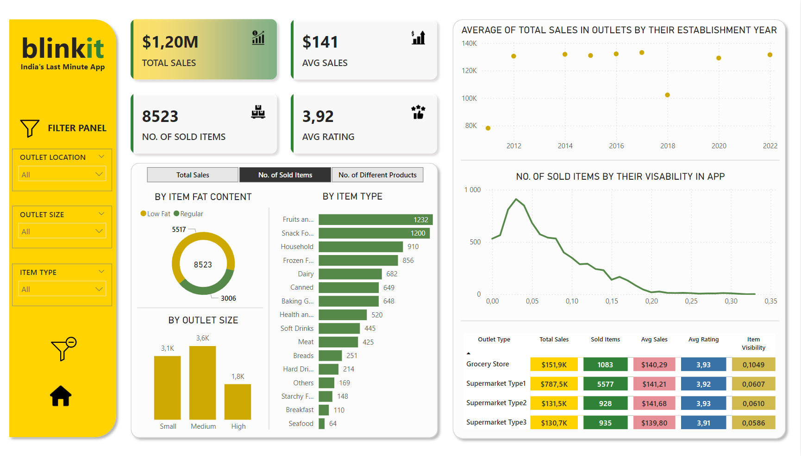
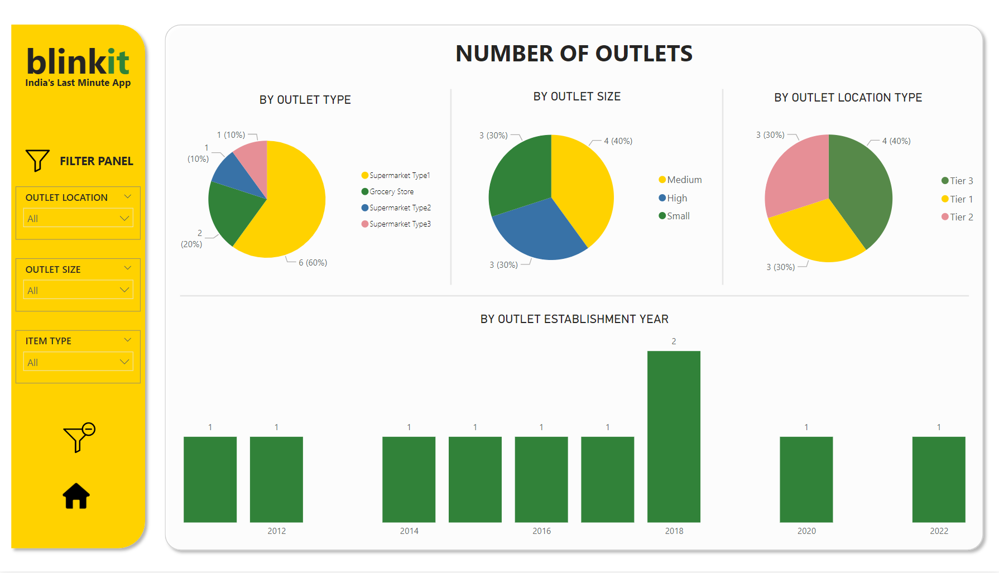

# Blinkit Sales Analysis (Power BI & Power Query)

## Project Overview

**Level**: Intermediate  

This project demonstrates data analysis of ***blinkit***, an Indian last-minute grocery delivery app. The goal was to analyze sales and operational data to uncover insights for business improvement and present the findings on a dashboard in a clear and accessible way for the client. The analysis involved data preparation, transformation, calculation and visualization using **Power BI** and **Power Query**.


## Objectives

1. **Perform data cleaning and transformation**: Ensure the dataset is accurate and ready for analysis by resolving data inconsistencies and adjusting the form of data, creating additional columns if needed.
2. **Provide data calculations**: Create DAX measures in Power BI to calculate and display various Key Performance Indicators (KPIs).
3. **Visualize data**: Build interactive Power BI dashboards to uncover key correlations and enable stakeholders to explore the data dynamically.
4. **Analyze results**: Carefully analyze all charts and other visualizations to draw conclusions and detect any previously unnoticed data inconsistencies.
5. **Generate business insights**: Provide actionable insights to aid decision-making, including outlet performance, sales trends, and product visibility.

## Project Structure

### 1. Performing data cleaning and transformation
- **Initial data exploration**

  The dataset (file named `BlinkIT Grocery Data.xlsx`) consisted of grocery sales data extracted from Excel. Data walkthrough revealed the following fields:
  - Item Details: `Item Fat Content`, `Item Identifier`, `Item Type`, `Item Visibility`, etc.
  - Outlet Details: `Outlet Identifier`, `Outlet Size`, `Outlet Type`, `Establishment Year`, etc.

- **Data preparation in Power Query**

  The data exhibited a reasonable level of quality so data preparation involved only two actions taken in several Power Query steps before creating visualizations in Power BI:
  - Cleaning 'Item Fat Content' Values: Standardized the values in the 'Item Fat Content' column by replacing inconsistent entries.
  - Rounding 'Item Visibility' Values: Duplicated the 'Item Visibility' column and rounded off the values to two decimal places in the new column.

  Each step's name has been manually adjusted to clearly reflect it's content. This way, anyone taking over the project can intuitively understand the purpose of each step.

  Query code (M language):
  ```M
  let
    Źródło = Excel.Workbook(File.Contents("C:\Users\julit\Pulpit\Analiza_danych_nauka\portfolio\Projekty\BlinkIT Grocery Data.xlsx"), null, true),
    #"BlinkIT Grocery Data_Sheet" = Źródło{[Item="BlinkIT Grocery Data",Kind="Sheet"]}[Data],
    #"Promoted Headers" = Table.PromoteHeaders(#"BlinkIT Grocery Data_Sheet", [PromoteAllScalars=true]),
    #"Changed Type" = Table.TransformColumnTypes(#"Promoted Headers",{{"Item Fat Content", type text}, {"Item Identifier", type text}, {"Item Type", type text}, {"Outlet Establishment Year", Int64.Type}, {"Outlet Identifier", type text}, {"Outlet Location Type", type text}, {"Outlet Size", type text}, {"Outlet Type", type text}, {"Item Visibility", type number}, {"Item Weight", type number}, {"Sales", type number}, {"Rating", Int64.Type}}),
    #"Replaced Value (LF -> Low Fat)" = Table.ReplaceValue(#"Changed Type","LF","Low Fat",Replacer.ReplaceText,{"Item Fat Content"}),
    #"Replaved Value (reg -> Regular)" = Table.ReplaceValue(#"Replaced Value (LF -> Low Fat)","reg","Regular",Replacer.ReplaceText,{"Item Fat Content"}),
    #"Capitalized Each Word in 'Item Fat Content'" = Table.TransformColumns(#"Replaved Value (reg -> Regular)",{{"Item Fat Content", Text.Proper, type text}}),
    #"Duplicated Column 'Item Visibility'" = Table.DuplicateColumn(#"Capitalized Each Word in 'Item Fat Content'", "Item Visibility", "Item Visibility (rounded)"),
    #"Rounded Off the Values in New Column" = Table.TransformColumns(#"Duplicated Column 'Item Visibility'",{{"Item Visibility (rounded)", each Number.Round(_, 2), type number}}),
    #"Reordered Column 'Item Visibility (rounded)'" = Table.ReorderColumns(#"Rounded Off the Values in New Column",{"Item Fat Content", "Item Identifier", "Item Type", "Outlet Establishment Year", "Outlet Identifier", "Outlet Location Type", "Outlet Size", "Outlet Type", "Item Visibility", "Item Visibility (rounded)", "Item Weight", "Sales", "Rating"})
  in
    #"Reordered Column 'Item Visibility (rounded)'"

- **Creating additional query**

  Created a new query by referencing the main query to analyze total sales by outlet and showing their establishment year.

  Query code (M language):
  ```M
  let
    Source = #"BlinkIT Grocery Data",
    #"Grouped Rows (Total Sales by Outlet Identifier)" = Table.Group(Source, {"Outlet Identifier"}, {{"Total Sales in Particular Outlet", each List.Sum([Sales]), type nullable number}}),
    #"Merged Queries" = Table.NestedJoin(#"Grouped Rows (Total Sales by Outlet Identifier)", {"Outlet Identifier"}, #"BlinkIT Grocery Data", {"Outlet Identifier"}, "BlinkIT Grocery Data", JoinKind.LeftOuter),
    #"Expanded BlinkIT Grocery Data With Column 'Outlet Establishment Year'" = Table.ExpandTableColumn(#"Merged Queries", "BlinkIT Grocery Data", {"Outlet Establishment Year"}, {"Outlet Establishment Year"}),
    #"Removed Duplicates From 'Outlet Identifier' Column" = Table.Distinct(#"Expanded BlinkIT Grocery Data With Column 'Outlet Establishment Year'", {"Outlet Identifier"})
  in
    #"Removed Duplicates From 'Outlet Identifier' Column"

### 2. Providing data calculations

Created the following measures in Power BI using DAX language:

```DAX
Avg Rating = AVERAGE('BlinkIT Grocery Data'[Rating])
Avg Sales = AVERAGE('BlinkIT Grocery Data'[Sales])
No. of Different Products = DISTINCTCOUNT('BlinkIT Grocery Data'[Item Identifier])
No. of Sold Items = COUNTROWS('BlinkIT Grocery Data')
Total Sales = SUM('BlinkIT Grocery Data'[Sales])
```
### 3. Visualizing data

- Created a metrics table to facilitate the creation of "Total Sales", "No. of Sold Items" and "No. of Different Products" buttons in the report.

```DAX
Metrics = {
    ("Total Sales", NAMEOF('BlinkIT Grocery Data'[Total Sales]), 0),
    ("No. of Sold Items", NAMEOF('BlinkIT Grocery Data'[No. of Sold Items]), 1),
    ("No. of Different Products", NAMEOF('BlinkIT Grocery Data'[No. of Different Products]), 2)
}
```
- Built interactive Power BI dashboards using many kinds of visualisations such as KPI cards, donut chart, pie charts, bar charts, line chart, scatter plot and table with conditional formatting.
- Optimized the numerical data presentation by configuring every visualisation settings (displaing units, valuing decimal places) to enhance clarity and readability.
- Added filter panel with "clear all slicers" and "go back to the main report" buttons.
- Ensured that the colors and style of the report were consistent.




### 4. Analyzing results

The initial dashboard displayed incorrect data for number of outlets by outlets size. A thorough check of this data in Power Query allowed to identify the problem, which was the discrepancy in the declared size of three of the ten outlets. To fix the problem, one size was chosen for each of these three outlets, and the correction was made using Conditional Column function in Power Query.
***Note: In a real-world scenario, this correction would be made after consulting with the client to confirm the accurate sizes.***

Full query code (M language) after correction:
```M
let
    Źródło = Excel.Workbook(File.Contents("C:\Users\julit\Pulpit\Analiza_danych_nauka\portfolio\Projekty\BlinkIT Grocery Data.xlsx"), null, true),
    #"BlinkIT Grocery Data_Sheet" = Źródło{[Item="BlinkIT Grocery Data",Kind="Sheet"]}[Data],
    #"Promoted Headers" = Table.PromoteHeaders(#"BlinkIT Grocery Data_Sheet", [PromoteAllScalars=true]),
    #"Changed Type" = Table.TransformColumnTypes(#"Promoted Headers",{{"Item Fat Content", type text}, {"Item Identifier", type text}, {"Item Type", type text}, {"Outlet Establishment Year", Int64.Type}, {"Outlet Identifier", type text}, {"Outlet Location Type", type text}, {"Outlet Size", type text}, {"Outlet Type", type text}, {"Item Visibility", type number}, {"Item Weight", type number}, {"Sales", type number}, {"Rating", Int64.Type}}),
    #"Replaced Value (LF -> Low Fat)" = Table.ReplaceValue(#"Changed Type","LF","Low Fat",Replacer.ReplaceText,{"Item Fat Content"}),
    #"Replaved Value (reg -> Regular)" = Table.ReplaceValue(#"Replaced Value (LF -> Low Fat)","reg","Regular",Replacer.ReplaceText,{"Item Fat Content"}),
    #"Capitalized Each Word in 'Item Fat Content'" = Table.TransformColumns(#"Replaved Value (reg -> Regular)",{{"Item Fat Content", Text.Proper, type text}}),
    #"Duplicated Column 'Item Visibility'" = Table.DuplicateColumn(#"Capitalized Each Word in 'Item Fat Content'", "Item Visibility", "Item Visibility (rounded)"),
    #"Rounded Off the Values in New Column" = Table.TransformColumns(#"Duplicated Column 'Item Visibility'",{{"Item Visibility (rounded)", each Number.Round(_, 2), type number}}),
    #"Reordered Column 'Item Visibility (rounded)'" = Table.ReorderColumns(#"Rounded Off the Values in New Column",{"Item Fat Content", "Item Identifier", "Item Type", "Outlet Establishment Year", "Outlet Identifier", "Outlet Location Type", "Outlet Size", "Outlet Type", "Item Visibility", "Item Visibility (rounded)", "Item Weight", "Sales", "Rating"}),
    #"Added Conditional Column 'Outlet Size PROPER'" = Table.AddColumn(#"Reordered Column 'Item Visibility (rounded)'", "Outlet Size PROPER", each if [Outlet Identifier] = "OUT010" then "Medium" else if [Outlet Identifier] = "OUT017" then "High" else if [Outlet Identifier] = "OUT045" then "High" else [Outlet Size]),
    #"Removed Column 'Outlet Size'" = Table.RemoveColumns(#"Added Conditional Column 'Outlet Size PROPER'",{"Outlet Size"}),
    #"Renamed Column 'Outlet Size PROPER' to 'Outlet Size'" = Table.RenameColumns(#"Removed Column 'Outlet Size'",{{"Outlet Size PROPER", "Outlet Size"}}),
    #"Reordered Column 'Outlet Size'" = Table.ReorderColumns(#"Renamed Column 'Outlet Size PROPER' to 'Outlet Size'",{"Item Fat Content", "Item Identifier", "Item Type", "Outlet Establishment Year", "Outlet Identifier", "Outlet Location Type", "Outlet Size", "Outlet Type", "Item Visibility", "Item Visibility (rounded)", "Item Weight", "Sales", "Rating"})
in
    #"Reordered Column 'Outlet Size'"
```

**The final apperance of the Power BI report:**




(For full access to interactive dashboards – please download the file named `blinkit_PowerBI_report.pbix`)

### 5. Generating business insights:

These are a few example business insights that could be provided to the client. In a real-world scenario, further insights would likely be developed based on the client's specific needs:

**1. Fat content influence:**
Low-fat items are sold more frequently than regular items, suggesting a consumer preference for healthier options. BlinkIT could consider expanding the low-fat product range.

**2. Outlet type with the lowest rating:**
The 'Supermarket Type3' outlet type has the lowest rating among all four outlet types. While the difference is small, it may be worth investigating the reasons behind this and potentially improving the performance of these outlets.

**3. Impact of item visibility on sales:**
The data indicates a peak in item sales at a visibility level of around 0,03. Beyond this point, sales start to decline as visibility increases. This trend suggests that items with very high visibility might not necessarily drive higher sales, possibly due to factors like overexposure or saturation. The fact that items with 0 visibility still show relatively high sales suggests that many customers are purchasing these items without needing direct prompts or promotions in the app. This could happen for several reasons like high customer awareness and loyalty to some brands or effective search functionality.

**4. Impact of outlet establishment year on sales:**
The average sales for outlets established in 2011 and 2018 are lower than those of outlets from other years and it may be worth investigating this the factors. One possible explanation could be unique organizational models introduced in these specific years that haven't resonated as well with customers. Additionally, heightened competition around the time of these outlets' openings may have impacted their ability to capture and retain market share effectively, resulting in lower performance.

## Author: Julita Wawreszuk-Chylińska (based on Data Tutorials project)

**LinkedIn**: [Julita Wawreszuk-Chylińska](https://www.linkedin.com/in/julita-wawreszuk-chylińska/)

Thank you for your interest in this project!
